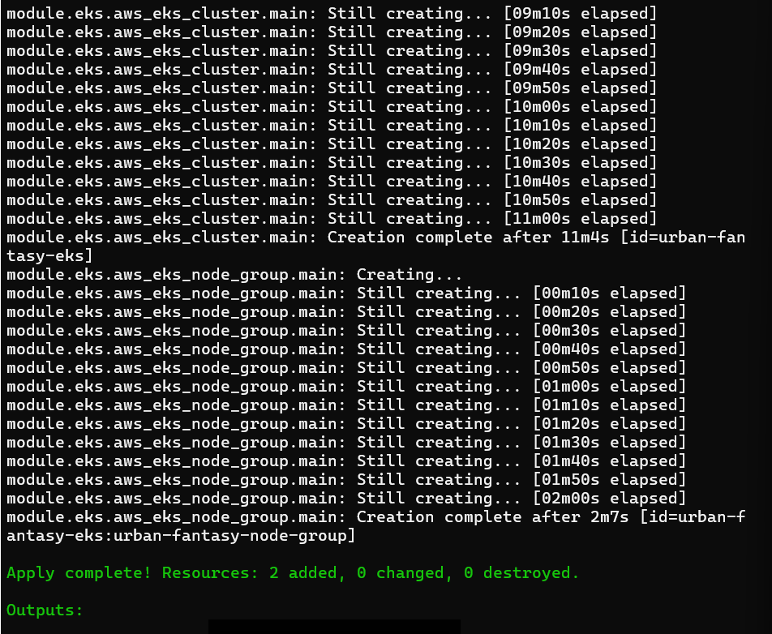
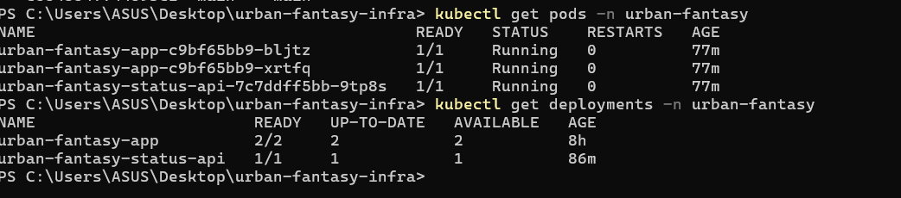
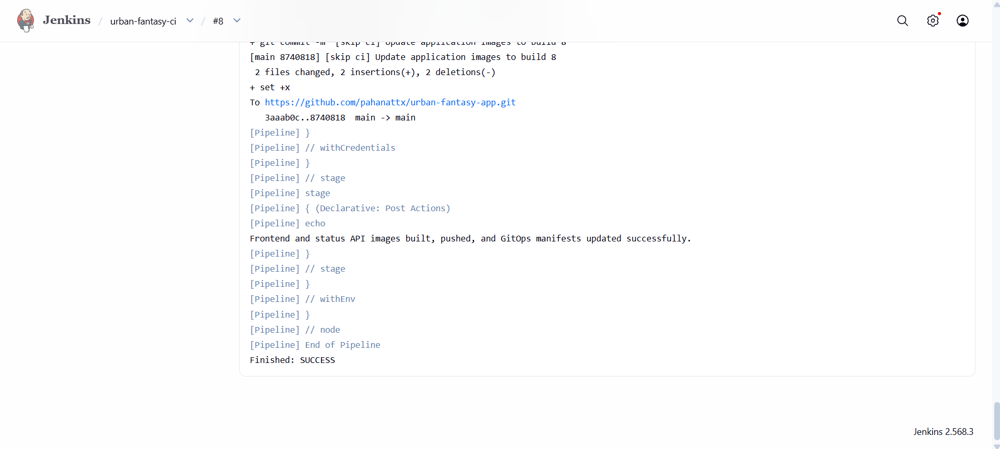
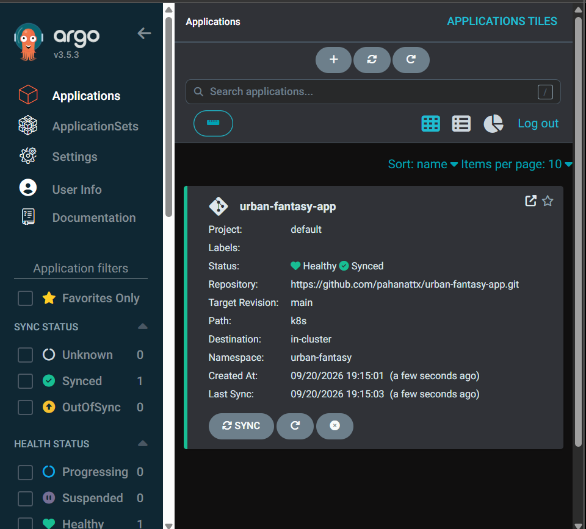
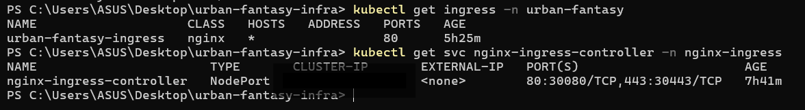
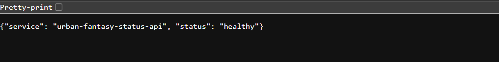
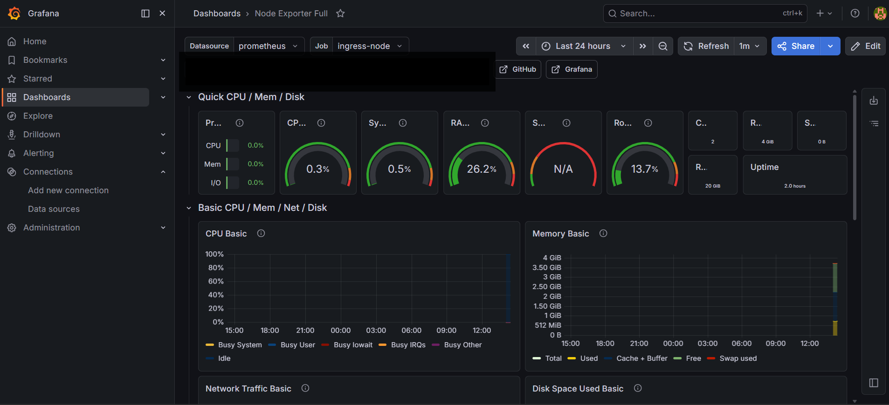
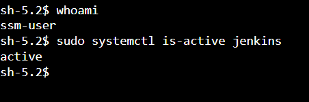

# Urban Fantasy GitOps Infrastructure

AWS GitOps platform built with Terraform, Amazon EKS, Jenkins, ArgoCD, NGINX Ingress, AWS SSM, Prometheus and Grafana.

## Architecture

Developer / GitHub → Jenkins CI → Docker Hub  
Jenkins → Git manifest update → ArgoCD → Amazon EKS

Internet → EC2 NGINX Gateway → NodePort 30080 → NGINX Ingress → Kubernetes Services → Pods

Routes:

- `/` → Frontend Service
- `/api/status` → Status API Service

## Technologies

- AWS
- Terraform
- Amazon EKS
- Kubernetes
- Jenkins
- ArgoCD
- Docker / Docker Hub
- NGINX Ingress
- AWS Systems Manager
- Prometheus
- Grafana

## Security

- EC2 administration through AWS Systems Manager Session Manager
- No SSH port 22 required
- Jenkins access restricted by administrator CIDR
- NodePort 30080 accepts traffic only from the NGINX gateway security group
- Terraform state, credentials and variable files excluded from Git

## Monitoring

Prometheus collects infrastructure metrics through Node Exporter and Grafana provides monitoring dashboards.

## Cost Management

The AWS infrastructure was destroyed after testing to prevent unnecessary cloud charges.

# Project Evidence

## Terraform Provisioning

## EKS Multi-Service Deployment

## Jenkins CI and GitOps Automation

## ArgoCD Synchronization

## NGINX Ingress and NodePort Routing

## Status API

## Monitoring Dashboard

## Keyless EC2 Administration

